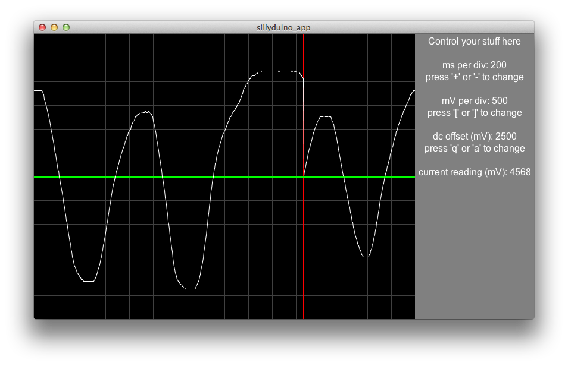
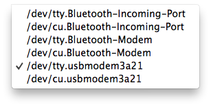

# sillyduino
A silly little Arduino oscilloscope from your friends at the Wiley Cousins Education Department



## requirements

* An Arduino from the following list (others may work but are untested)
  * [Arduino Uno](http://arduino.cc/en/Main/ArduinoBoardUno)
  * [SparkFun Pro Micro 5V/16MHz](https://www.sparkfun.com/products/12640)
* [The Arduino IDE](http://www.arduino.cc/)
* [Processing](http://www.processing.org/)

## getting started

1. Upload `sillyduino_sketch.ino` to your Arduino
2. Open `sillyduino_app.pde` in Processing
    * You will need to make some changes at the top of the sketch:
    ```processing
    // change this to true if you're using a sparkfun pro micro
    boolean proMicro = false;
    // serial port to use
    // get this from looking at your port list in the Arduino IDE
    int serialPort = 2;
    ```
    * If you are using a SparkFun Pro Micro, change `proMicro` to true
    * Open the Arduino IDE, go to Tools > Serial Port, and look for your Arduino in that list
    * Starting from 0, count where it is in the list
        * On mac or linux, only count ports with `tty` in their name
        * In this list, you'd count: 0, 1, 2

        

    * Change `int serialPort = 2` to `int serialPort = theNumberYouJustCounted`
3. Run the sketch in Processing
4. enjoy you half-broken oscilloscope and profit

## troubleshooting
If the app opens frozen, or you get a stream of `waiting` in the processing command line window, try these things:

1. Press stop and then start again
2. Stop the sketch, unplug the Arduino, plug it back it, then start the sketch again
3. Open an issue in this repository with the Arduino you're using, the contents of your port list from Arduino IDE, and your Processing sketch edits from above

## thanks

Thanks to [this webpage](http://accrochages.drone.ws/en/node/90) for giving me a nice jumping off point.
